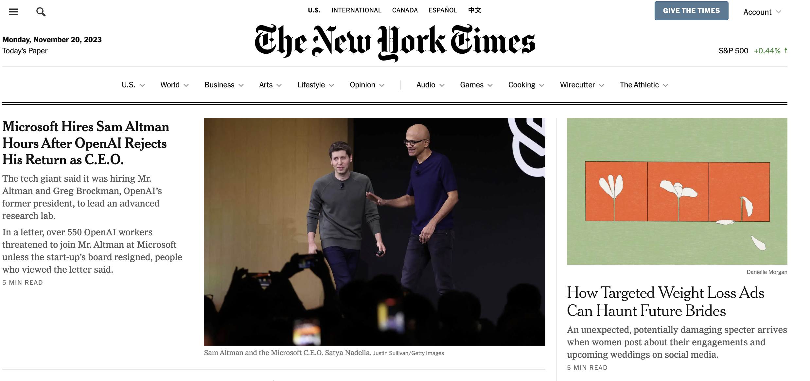
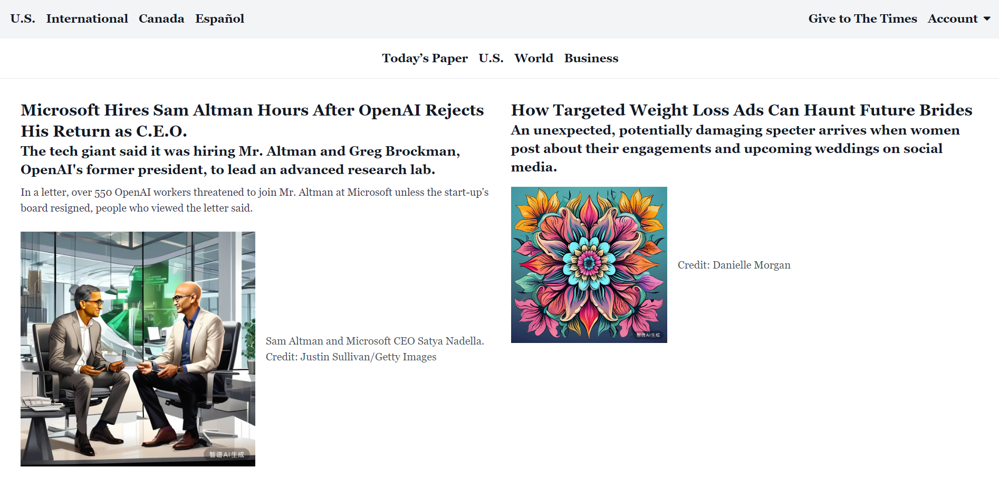

# screenshot2code

<p align="center">
  <a href="./README_en.md">English</a> |
  <a href="./README.md">简体中文</a>
</p>


一个简单的使用AI将屏幕截图转换成纯代码的小工具。


## 🎉 特性
- **HTML+tailwind**: 可以将屏幕截图转换成HTML+tailwind。
- **支持GLM-4**: 使用GLM-4v识别图像并使用GLM-4生成代码。
- **支持cogview-3**: 可以使用cogview-3生成示例图像。
- **更多功能**: 还在开发中。

## 🚀 无需配置即可使用

您可以在发行版里面直接下载并使用此项目的Windows安装包，根据安装程序进行安装并使用，无需配置任何依赖。

## 🛠 本地配置

本项目是前后端分离的项目，前端是使用PyQt5构建的在Windows系统上运行的图形化界面，后端是使用FastAPI编写的可以在Windows系统或Linux服务器上运行的服务。

要运行此项目，您需要安装 Python 3.8 或更高版本。首先克隆此仓库：

```bash
git clone https://github.com/LinYujupiter/screenshot2code.git
cd screenshot2code
```

### 1. 环境配置

#### · 使用 Conda

如果您使用 Conda，可以按照以下步骤设置和激活虚拟环境：

1. **创建虚拟环境**：

   ```bash
   conda create -n screenshot2code python=3.8
   ```

2. **激活虚拟环境**：

   ```bash
   conda activate screenshot2code
   ```

3. **安装依赖**：

   在激活的虚拟环境中，运行：

   ```bash
   pip install -r requirements.txt
   ```

#### · 不使用 Conda

如果您不使用 Conda，可以直接使用 pip 安装依赖：

```bash
pip install -r requirements.txt
```

### 2. 运行后端服务

在安装了所有依赖之后，您可以通过以下命令启动后端服务：

```bash
cd backend
uvicorn main:app --host 0.0.0.0 --port 7001

# 或者使用以下命令
python3 start.py
```

在Linux服务器上，您也可以通过以下命令启动或终止后端服务：

```bash
cd backend
sh run.sh  # 启动服务
sh stop.sh # 终止服务
```

在Windows系统上，您也可以通过以下命令启动或终止后端服务：

```bash
cd backend
run.bat  # 启动服务
stop.bat   # 终止服务

# 或者使用以下命令
python3 start.py
```
在Windows系统上，您也可以进入backend/backend文件夹，双击运行backend.exe文件。

### 3. 运行前端界面

前端程序只能在Windows系统上运行，在安装了所有依赖之后，您可以通过以下命令启动前端程序：

```bash
cd frontend
python3 main.py
```
或者您也可以进入frontend/frontend文件夹，双击运行frontend.exe文件。


## 📚 运行示例

**NYTimes**

| 原始图像                                                                                                                                                       | 转换后                                                                                                                                                         |
| --------------------------------------------------------------------------------------------------------------------------------------------------------------- | --------------------------------------------------------------------------------------------------------------------------------------------------------------- |
|  |  |

## 🙋‍♂️ FAQs

- **代码的生成逻辑是怎么样的？** - 本程序会先将屏幕截图发送给GLM-4v模型来生成图像描述，然后将生成的描述发送给GLM-4模型来生成代码，最后将生成的代码中的图像的alt描述发送给cogview-3模型来生成图片。
- **为什么我的代码生成的结果和预期不一样？** - 请检查您的屏幕截图是否清晰，并确保您的屏幕截图中包含足够的信息以生成正确的代码。如果您的屏幕截图仍然无法生成正确的代码，请尝试重新截图或联系我。
- **我要怎么获取智谱的API-key？** - 请前往[智谱开发者平台](https://maas.aminer.cn/usercenter/apikeys)获取。
- **后端服务器如何配置环境变量？** - 请在运行后端服务时，在config.json中修改对应的变量。
- **我要如何提供反馈？** - 您可以在[GitHub Issues](https://github.com/LinYujupiter/screenshot2code/issues)中提交问题或建议。也可以通过[我的主页](https://github.com/LinYujupiter)中的联系方式来联系我。


## 🙈 TODO

- [ ] 增加追问逻辑，处理因达到最大输出token而被截断的代码。
- [ ] 支持更多图像识别模型。
- [ ] 支持更多图像生成模型。
- [ ] 增加图像对比逻辑，让AI评估生成的网页与原屏幕截图的差异并修改代码。
- [ ] 增加web前端界面。
- [ ] 增加自定义代码模版。
- [ ] 增加更多代码技术栈。

## 🤝 贡献指南
您可以在[GitHub Issues](https://github.com/LinYujupiter/screenshot2code/issues)中提交问题或建议。

也可以查看我们的[项目文档](https://linyujupiter.github.io/screenshot2code/)，以了解如何为该项目做出贡献，并在[GitHub pull requests](https://github.com/LinYujupiter/screenshot2code/pulls)中提交您的代码更改。

我们欢迎任何形式的贡献，无论是新功能的提议、代码改进还是问题报告。请确保遵循最佳实践和代码风格指南。

感谢所有为本项目做出贡献的贡献者！
