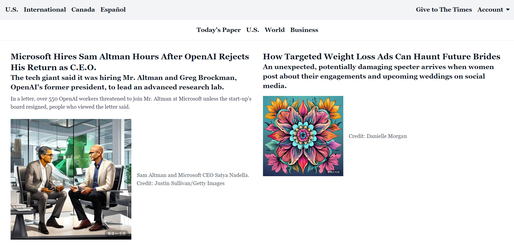

# screenshot2code

<p align="center">
  <a href="./README_en.md">English</a> |
  <a href="./README.md">简体中文</a>
</p>


A simple tool that utilizes AI to convert screen captures into pure code.


## 🎉 Features
- **HTML+tailwind**: Convert screen captures into HTML+tailwind.
- **GLM-4 Support**: Recognize images using GLM-4v and generate code using GLM-4.
- **cogview-3 Support**: Generate example images using cogview-3.
- **More to come**: Still in development.

## 🚀 Ready to Use

You can directly download and use the Windows installer of this project in the release section. Install and use it according to the installer without any additional configuration.

## 🛠 Local Setup

This project is a frontend and backend separated project. The frontend is a graphical interface running on Windows system built using PyQt5, and the backend is a service running on Windows system or Linux server written in FastAPI.

To run this project, you need to install Python 3.8 or higher version. First, clone this repository:

```bash
git clone https://github.com/LinYujupiter/screenshot2code.git
cd screenshot2code
```

### 1. Environment Setup

#### · Using Conda

If you're using Conda, you can set up and activate a virtual environment by following these steps:

1. **Create a virtual environment**:

   ```bash
   conda create -n screenshot2code python=3.8
   ```

2. **Activate the virtual environment**:

   ```bash
   conda activate screenshot2code
   ```

3. **Install dependencies**:

   In the activated virtual environment, run:

   ```bash
   pip install -r requirements.txt
   ```

#### · Without Conda

If you're not using Conda, you can directly install dependencies using pip:

```bash
pip install -r requirements.txt
```

### 2. Run Backend Service

After installing all dependencies, you can start the backend service with the following command:

```bash
cd backend
uvicorn main:app --host 0.0.0.0 --port 7001

# Or use the following command
python3 start.py
```

On a Linux server, you can also start or stop the backend service with the following commands:

```bash
cd backend
sh run.sh  # Start the service
sh stop.sh # Stop the service
```

On a Windows system, you can also start or stop the backend service with the following commands:

```bash
cd backend
run.bat  # Start the service
stop.bat   # Stop the service

# Or use the following command
python3 start.py
```
On a Windows system, you can also go into the backend/backend folder, double-click the backend.exe file to run.

### 3. Run Frontend Interface

The frontend program can only run on Windows system. After installing all dependencies, you can start the frontend program with the following command:

```bash
cd frontend
python3 main.py
```
Or you can go into the frontend/frontend folder, double-click the frontend.exe file to run.

## 📚 Example Run

**NYTimes**

| Original Image                                                                                                                                                | Converted                                                                                                                                             |
| ------------------------------------------------------------------------------------------------------------------------------------------------------------ | ----------------------------------------------------------------------------------------------------------------------------------------------------- |
|  |  |

## 🙋‍♂️ FAQs

- **What is the logic behind code generation?** - This program first sends the screen capture to the GLM-4v model to generate image descriptions, then sends the generated descriptions to the GLM-4 model to generate code, and finally sends the alt descriptions of the images in the generated code to the cogview-3 model to generate images.
- **Why is my generated code different from what I expected?** - Please check if your screen capture is clear and make sure it contains enough information to generate the correct code. If your screen capture still cannot generate the correct code, try recapturing or contacting me.
- **How can I obtain an API key for cogview?** - Please go to [CogView Developer Platform](https://maas.aminer.cn/usercenter/apikeys) to obtain one.
- **How to configure environment variables for the backend server?** - Please modify the corresponding variables in config.json when running the backend service.
- **How can I provide feedback?** - You can submit issues or suggestions in [GitHub Issues](https://github.com/LinYujupiter/screenshot2code/issues). You can also contact me through the contact information on [my homepage](https://github.com/LinYujupiter).

## 🙈 TODO

- [ ] Add follow-up logic to handle code truncated due to reaching maximum output tokens.
- [ ] Support more image recognition models.
- [ ] Support more image generation models.
- [ ] Add image comparison logic to allow AI to assess differences between generated web pages and original screen captures and modify code accordingly.
- [ ] Add web frontend interface.
- [ ] Add custom code templates.
- [ ] Add more code technology stacks.

## 🤝 Contribution Guidelines
You can submit issues or suggestions in [GitHub Issues](https://github.com/LinYujupiter/screenshot2code/issues).

You can also refer to our [project documentation](https://linyujupiter.github.io/screenshot2code/) to learn how to contribute to the project and submit your code changes in [GitHub pull requests](https://github.com/LinYujupiter/screenshot2code/pulls).

We welcome any form of contribution, whether it's proposing new features, improving code, or reporting issues. Please make sure to follow best practices and code style guidelines.

Thanks to all contributors who have contributed to this project!