# 自定义身法
## 如何自定义按键为某身法
身法区的按键可以把这些数字修改为你鼠标对应的按键，例如修改“ydqt = 4”，那么你按下鼠标的g4键时可以自动实现“右蹬墙跳”操作。

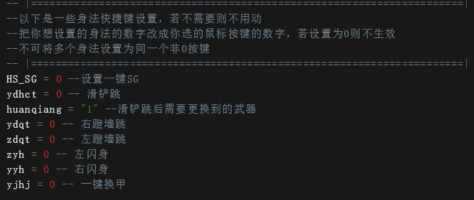

- 要先清除对应按键上原有的指令：点击GHUB首页你的鼠标，点击左侧“分配”，把右侧鼠标上原有的指令清除掉。
- g1一般是鼠标左键，g2一般是鼠标右键。禁止设置身法为这两个键，否则出现bug自行负责。
- 禁止将不同身法设置为同一个键。

_不同的罗技鼠标的按键号不一样，请在下面对照着你的鼠标型号来查看键位。_

## g100S按键编号图
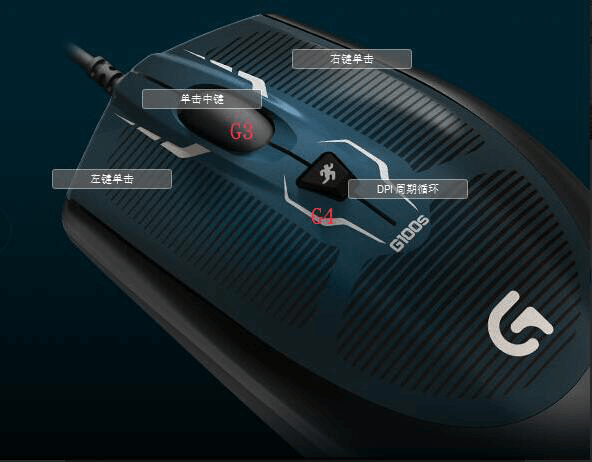

## g102按键编号图
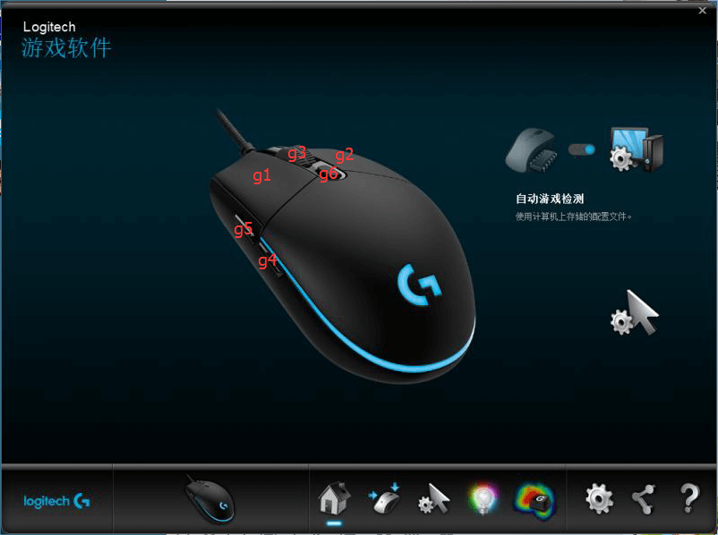

## g300S按键编号图
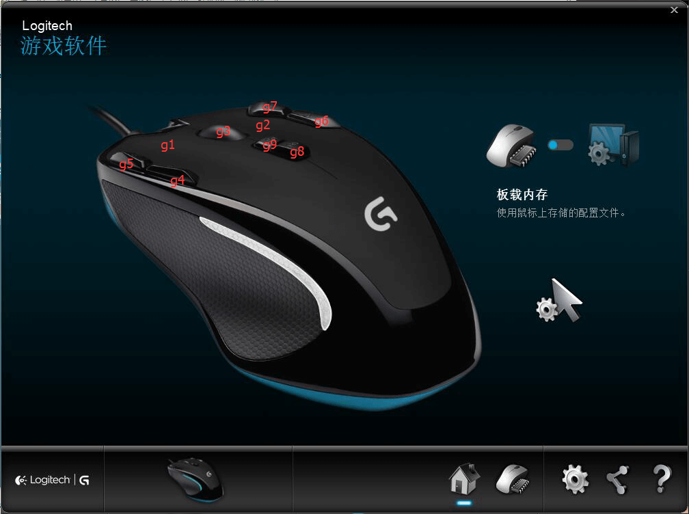

## g302按键编号图
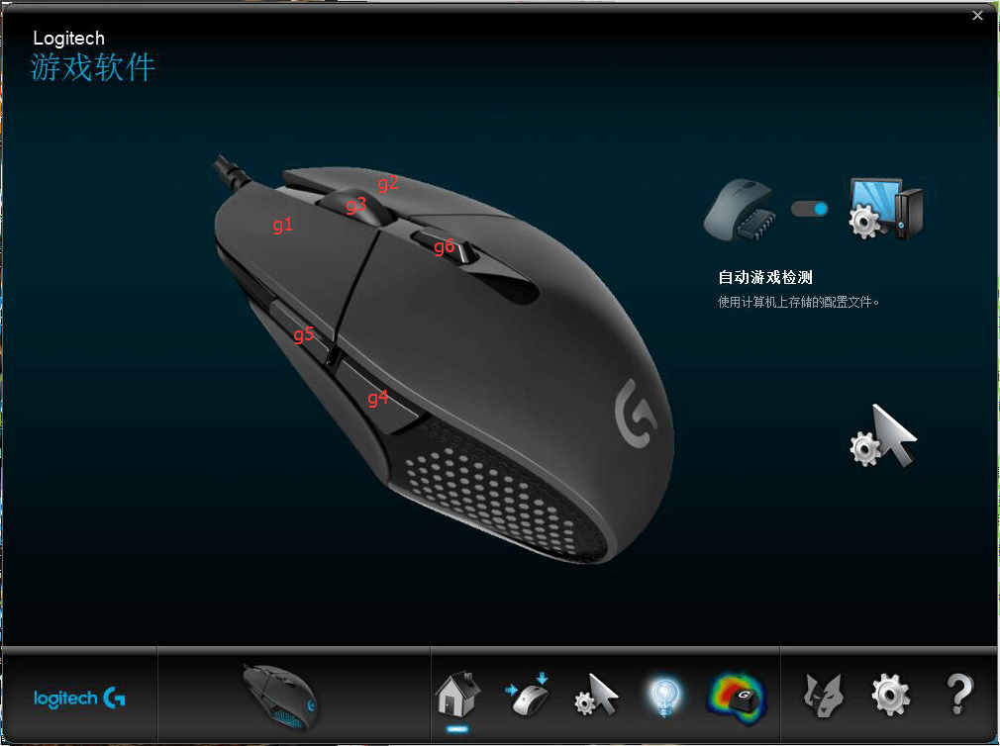

## g400按键编号图
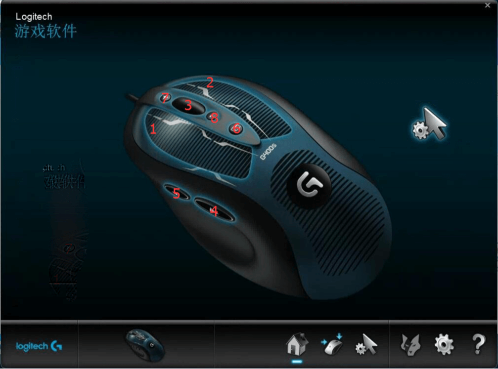

## g400S按键编号图
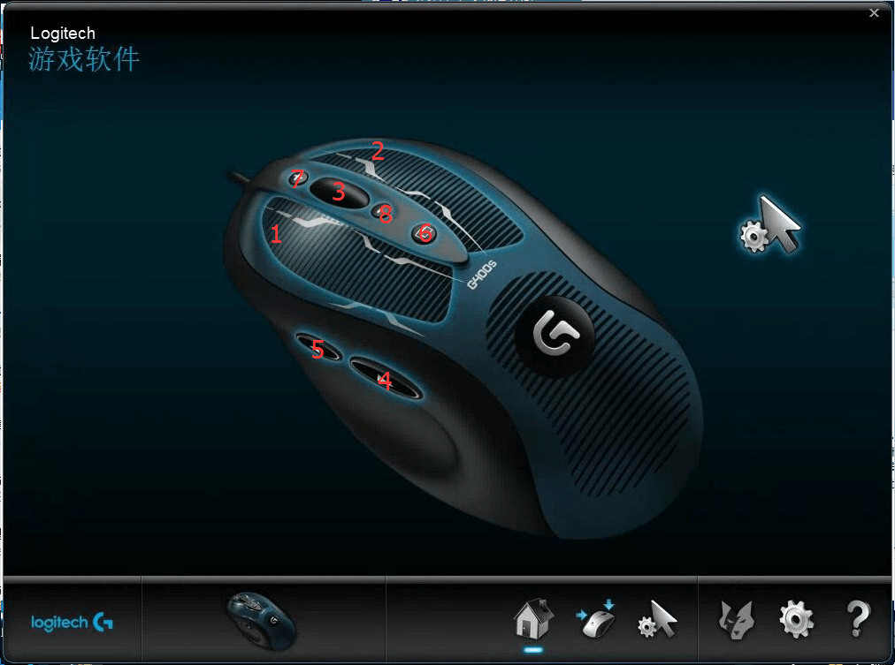

## g402按键编号图
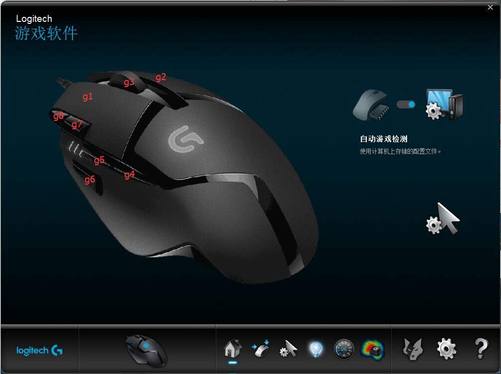

## g403按键编号图
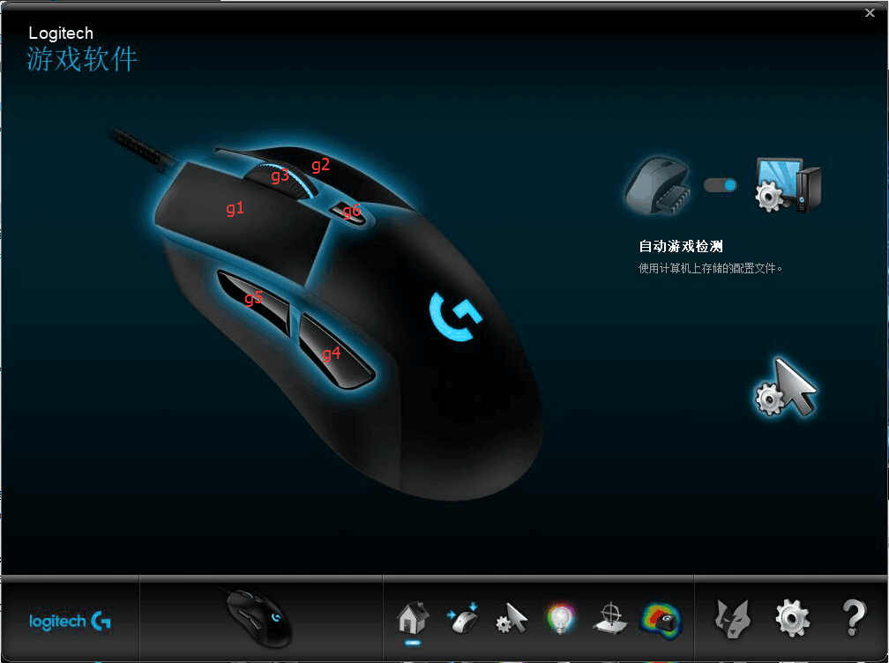

## g500S按键编号图
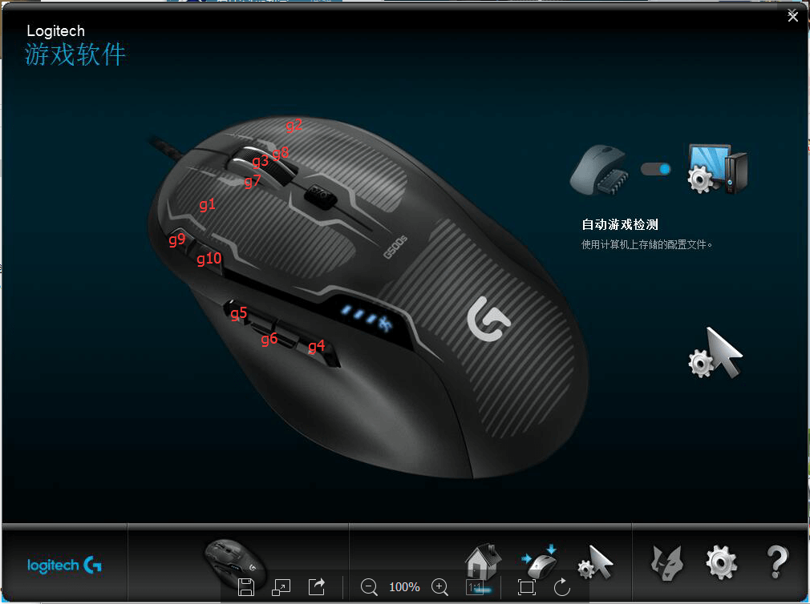

## g502按键编号图
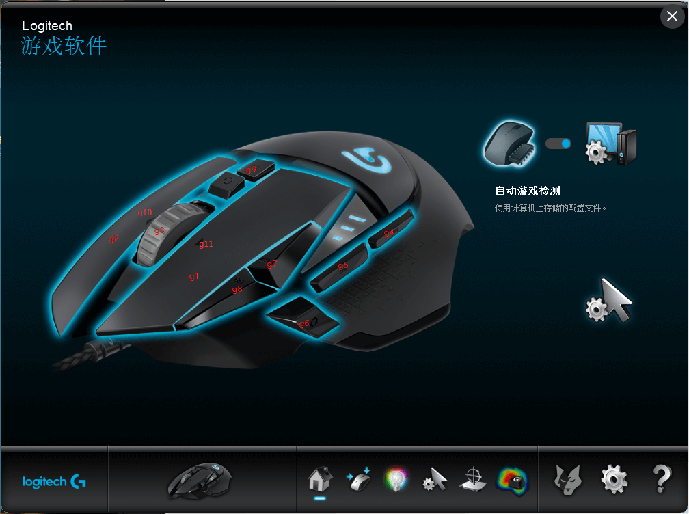

## g700按键编号图
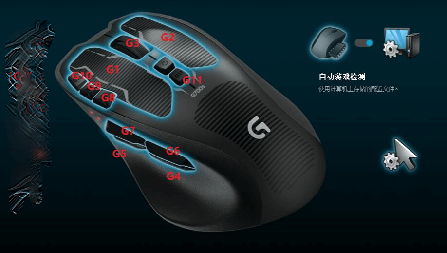

## g900按键编号图
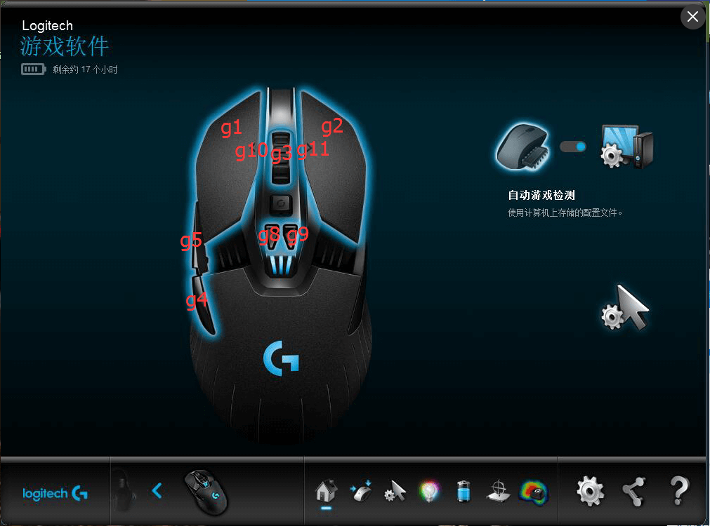

## gpro按键编号图
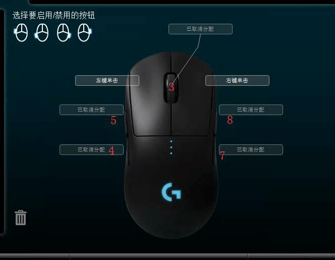