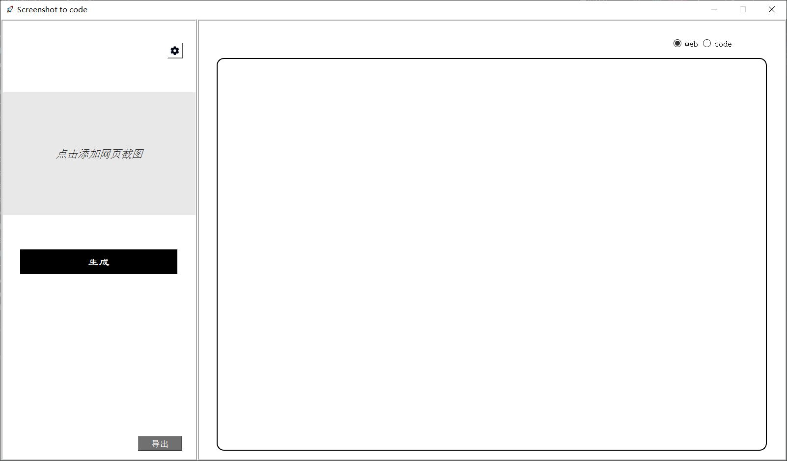
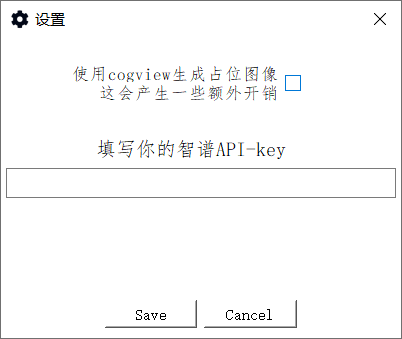

# main_form

## Components

This section of code serves as the implementation of the backend main interface, consisting of the following components:

- Screenshot area
- Code preview area
- Settings panel
- Generate button
- Export button

Example of the main interface:

## Functional Logic
### Screenshot Area

The screenshot area is where users select screenshots.

The screenshot area collects the path of the selected image by the user through the `open_image` function and saves it in the `img_path` variable.

### Code Preview Area

The code preview area is where users preview the generated code, allowing users to see the effect of the generated webpage code.

This functionality is mainly implemented through the `self.web_view` control, where the displayed code is stored in the `self.html` variable.

There are buttons in the top right corner to toggle between displaying code and webpage, implemented by the `toggle_view` function.

### Settings Panel

The settings panel is where users save the API key and configure whether to generate images.

Example:

Its main implementation is in *settings_dialog.py*. In the main panel, this functionality is achieved through the `show_settings_dialog` function.

The API key is stored in the `self.api_key` variable.

Whether to generate images is stored in the `self.isImageGenerationEnabled` variable.

### Generate Button

Clicking the generate button initiates WebSocket communication with the backend interface and transmits the base64 encoding of the image along with the `self.api_key` and `self.isImageGenerationEnabled` variables.

Upon completion of sending, it waits to receive information from the backend and constantly updates the status label and code preview area.

The functionality triggered when clicking the generate button is implemented by the `connect_to_server` function.

The `update_label` function implements the functionality of receiving information and continuously updating the status label and code preview area.

### Export Button

Clicking the export button exports the content of the `self.html` variable to the path selected by the user. This is primarily implemented in the `export_html` function.