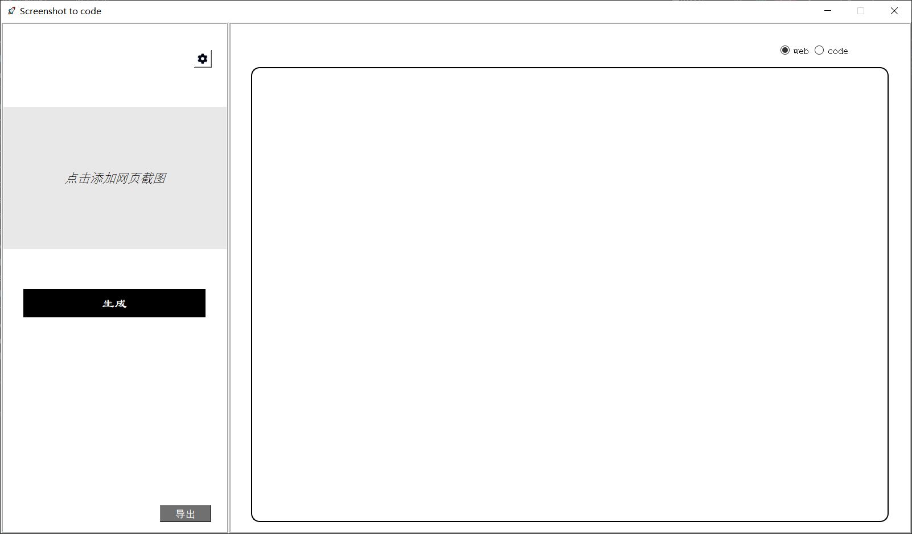
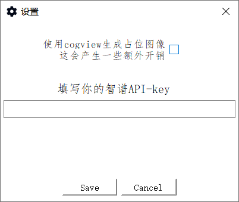

# main_form

## 组成成分

本部分代码作为后端主界面的实现，共有以下组件：

- 截图区
- 代码预览区
- 设置面板
- 生成按钮
- 导出按钮

主界面示例图：

## 功能逻辑
### 截图区

截图区是用户选择截图的地方。

截图区会通过`open_image`函数采集用户选择的图片的路径，并保存在`img_path`变量中。

### 代码预览区

代码预览区是用户预览代码的地方，用户可以在这里预览生成的网页代码的效果。

主要是通过`self.web_view`控件来实现该功能，其中显示的代码由`self.html`变量储存。

右上角有切换显示代码和网页的按钮，该功能由`toggle_view`函数实现。

### 设置面板

设置面板是用户保存API-key以及设置是否生成图片的地方。

示例图：

其主要实现在*settings_dialog.py*中。在主面板中，通过`show_settings_dialog`函数实现该功能。

其中API-key由`self.api_key`变量储存。

是否生成图片由`self.isImageGenerationEnabled`变量储存。

### 生成按钮

点击生成按钮会向后端接口发起websocket通信并传输图片的base64编码以及`self.api_key`变量和`self.isImageGenerationEnabled`变量。

在发送完成之后，等待接收来自后端的信息并时刻更新状态标签和代码预览区。

`connect_to_server`函数实现了点击生成按钮时触发的功能。

`update_label`函数实现了接收信息并实时更新状态标签和代码预览区的功能。

### 导出按钮

点击导出按钮会将`self.html`变量的内容导出到用户选定的路径。主要在`export_html`函数中实现。
