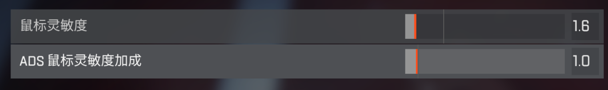
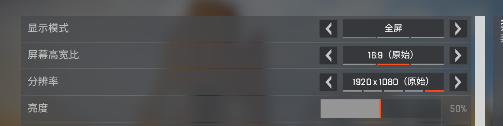
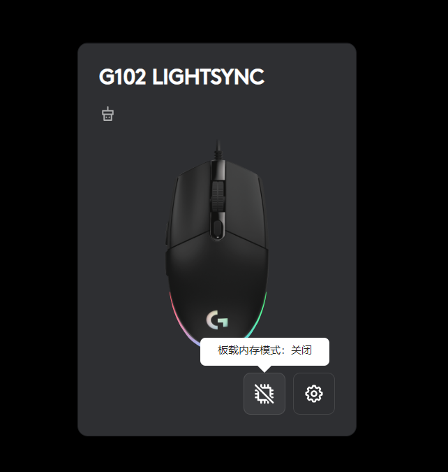
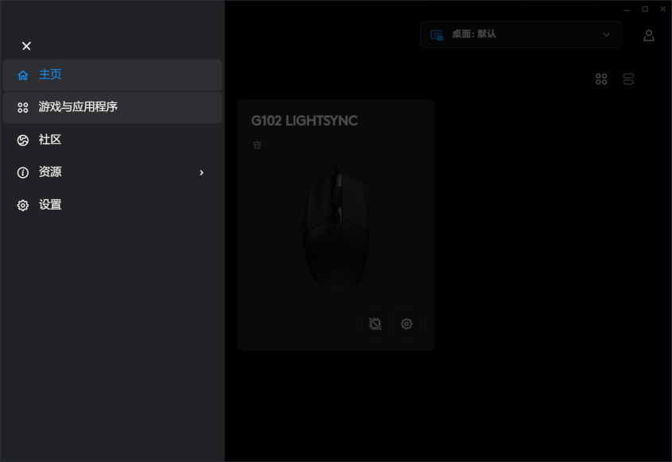
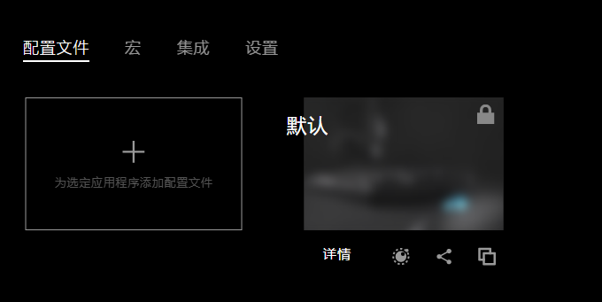
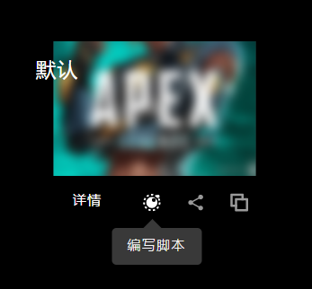
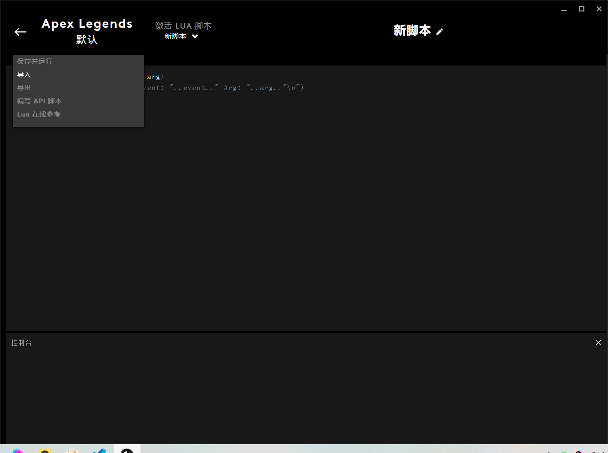

# 快速开始
## 一．游戏内设置
### 灵敏度设置
- 游戏灵敏度设置1.6

- ADS设置1.0

注意：如果觉得视觉移动慢，可以提高GHUB面板内的DPI（点击GHUB首页你的鼠标然后调整灵敏度），就可以恢复正常，游戏设置里面的灵敏度保持1.6不要动！

### 游戏语言设置
- 游戏里面的语言：简体中文

## 二．登录三七识别工具
_全部以管理员模式启动！！！_

- 打开三七识别工具，在菜单——>设置中，选择你的配置。其中，分辨率选择你APEX游戏运行时的分辨率，而不是系统分辨率。

- 版本按照你购买的激活码类型选择在线版或本地版（试用模式不需要选择版本），具体可见 [在线版与本地版的区别](/introduction/difference) 篇

- 模式可暂时随意选择一个，具体配置可以查看 [修改压枪弹道](/Advanced/change_mode) 篇。

- 然后点击保存设置，并输入激活码登录即可（试用模式直接点击试用按钮即可）

APEX游戏运行时的分辨率在APEX的设置里看（尽量选择原始）：

## 三．安装GHUB及其配置
_需要保持三七自动识别工具处于登录状态或者试用状态_

- [点击此处下载GHUB的最新版本](https://www.logitechg.com/zh-cn/innovation/g-hub.html)，三七识别工具的安装包内也附有GHUB的安装包

- 安装GHUB的2022以上版本，关闭自动更新

- 若开启了板载模式，一定要关闭板载模式

- 然后点游戏与应用程序

- 点击详情，点设置为永久性配置文件

- 然后点击详情旁边的编写脚本，点击创建新的lua脚本。

- 导入安装包中的*三七自动识别.lua*文件，然后点击保存并运行。注意：必须使三七自动识别工具登录过一次或者处于试用状态，否则保存脚本会出错。

- 然后进入游戏，打开键盘上的 *大写锁定* ，即可压枪操作。
